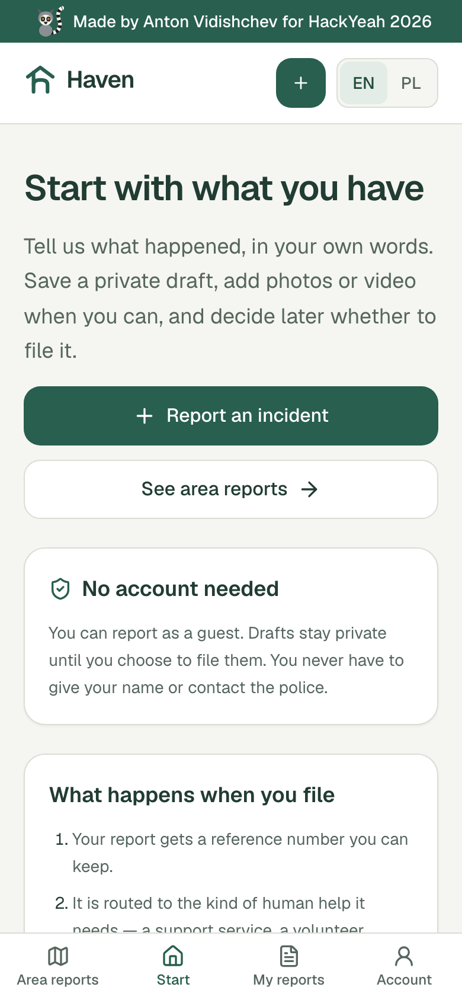
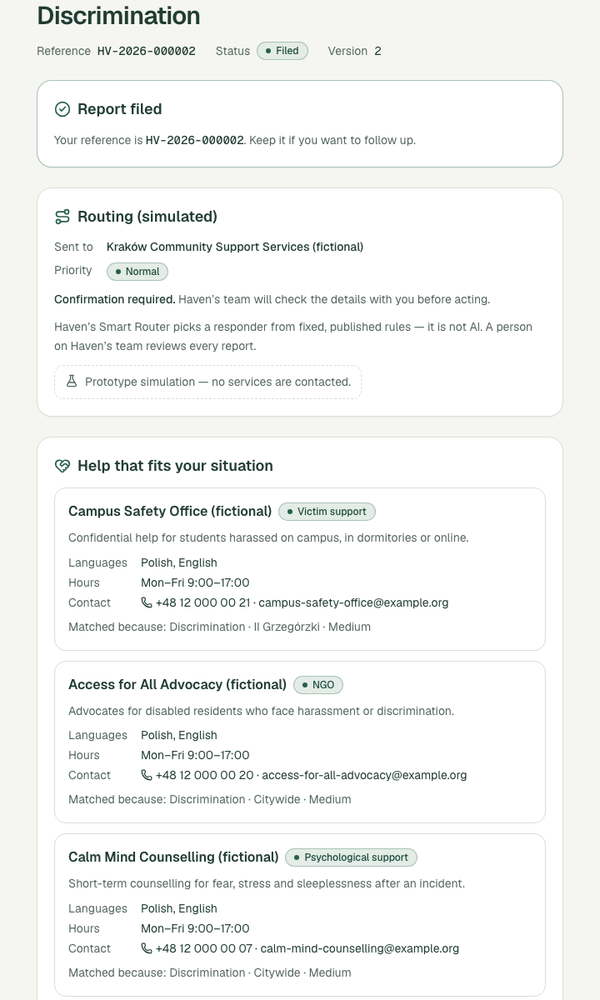
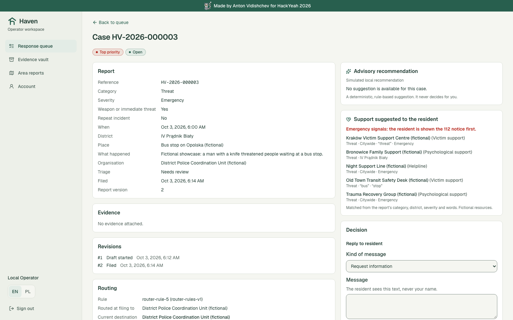
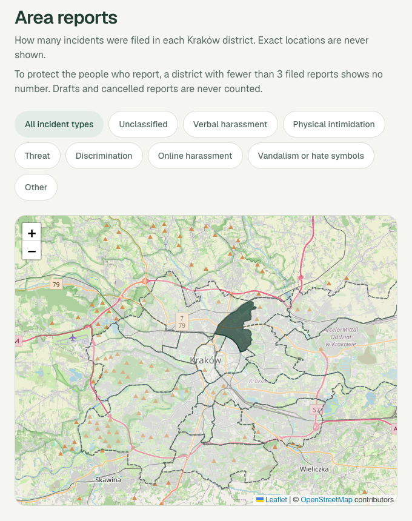

<!-- _class: lead -->
<!-- _paginate: false -->
<!-- _footer: '' -->

# Haven

## A safe middle path for reporting harassment and discrimination in Kraków

Report in a few minutes, without an account, and get routed to the right kind of **human** help.

**Live:** haven-hackyeah.polandcentral.cloudapp.azure.com
**Code:** github.com/antonvidishchev/haven-hackyeah2026

 

Made by Anton Vidishchev for HackYeah 2026 · Smart City open task
Prototype: all organisations, people and resources are fictional. In danger, call 112.

---

## The problem: "call the police" or "say nothing"

1 in 10
women in Poland have experienced stalking; <b style="display:inline;font-size:21px">1 in 8</b> sexual harassment at work

15%
of the incidents covered by the study were reported to the police

+30%
hate-crime reports involving Ukrainians, H1 2026 vs H1 2025

 

- A person harassed on a tram, at a stop, in their street or online often isn't ready to go to the police, so **most say nothing**.
- Residents miss support, and the city's services **can't see where help is needed**.

Sources: nationwide study of women in Poland, czasopisma.inp.pan.pl/index.php/bk/article/view/5715 · Police figures via Notes from Poland, 17 Jul 2026. The figures measure different harms, not a single Kraków trend.

---

## Haven connects four groups in one calm channel

| Who                       | What they do in Haven                                                                |
| ------------------------- | ------------------------------------------------------------------------------------ |
| **Residents**             | Report as a guest or signed in, EN/PL, web or phone; add photos, video, audio, place |
| **Operators**             | A human reviews every report in a prioritised queue                                  |
| **Partner organisations** | Volunteer network, professional support, police coordination unit claim and act      |
| **The city**              | Sees demand per district without seeing people                                       |

Incident types: verbal harassment, intimidation, threats, discrimination, online harassment, hate symbols and vandalism.

---

## One report's journey, from tram 8 to a closed case

1. **Report.** Someone is insulted about their accent on tram 8 near Teatr Bagatela. With no sign-up, they describe it, pin the stop and file, then get reference `HV-2026-…`.
2. **Route.** The Smart Router matches _low severity_ → **volunteer network**.
3. **Help now.** The resident immediately sees matched local support.
4. **Triage.** The operator checks it and sends it on in one click.
5. **Act.** A volunteer official claims it, records a phone call and closes it.

A filed report as the resident sees it: routing card and matched help (here: discrimination → professional support).

---

## Explainable routing and help that fits

**Smart Router: published rules, not AI**

| Report              | Goes to              | Priority         |
| ------------------- | -------------------- | ---------------- |
| Low severity        | Volunteer network    | Normal           |
| Medium + evidence   | Professional support | Normal           |
| Medium, no evidence | Professional support | Confirm first    |
| High                | Professional support | Expedited        |
| Emergency / weapon  | Police coordination  | **Top priority** |

Each decision stores its rule, ruleset version and a SHA-256 digest of the rules.

**Support matchmaking**

- Up to 5 local services (legal aid, counselling, NGOs, helplines)
- Scored by category, district, keywords and severity
- Each one shows a plain **"Matched because: Discrimination · Citywide · Medium"**
- Emergency signals show the **112** notice first

---

## Every report reaches a human

**Operators** work a queue: _Needs review_, _Awaiting resident_, _Handled_.

- Send a case to an organisation, ask the resident for more, or close it with a neutral notice
- A labelled, _simulated_ advisory recommendation can be followed in one click; whether it was followed is audited
- Read-only **evidence vault**

**Officials** claim a case, record actions outside Haven (call, visit, referral) and close it with an outcome.

---

## Data for the city, with privacy first

**Area reports** is the public front page.

- Filed reports counted per district for all 18 Kraków districts, filterable by incident type
- A district with **fewer than 3 reports shows no number** (k-anonymity)
- Drafts and cancelled reports are never counted
- Exact locations are never shown; no area is labelled "unsafe"

**Shows where to put** volunteers, outreach and support hours.

---

## Built for trust and for everyone

<b>Trust</b>Evidence fingerprinted with SHA-256 and streamed only to authorised staff. Append-only audit log of every staff decision. Concurrent edits are rejected, never overwritten.

<b>Low barrier</b>No account needed. Drafts stay private and autosave. English and Polish. Web plus an Expo phone app with in-app audio and video capture and device location.

<b>Accessible and calm</b>Targets WCAG 2.1 AA, with axe checks on every role's pages. 44 px touch targets, reduced motion, and light and dark themes in the "Calm Haven" design.

 

**Smart City fit:** communication between residents and institutions · response to incidents and emergencies · urban data for decisions · accessible public services.

---

<!-- _class: dense -->

## Built in 24 hours, live on Azure

**Architecture**

- **Web:** Next.js 16 for residents, staff and the public
- **Mobile:** Expo app for residents
- **API:** NestJS 12 (Fastify) with role-based access
- **Database:** SurrealDB, with full-text search for matching
- Shared typed rules (zod) across all apps
- **Hosting:** one Azure VM with Docker Compose and Caddy (HTTPS)
- More than 200 unit and end-to-end tests, plus axe accessibility checks

| Real in the prototype                                                              | Simulated                                       |
| ---------------------------------------------------------------------------------- | ----------------------------------------------- |
| Reports, evidence, routing, queue, partner workflow, audit, Area reports, matching | Partner organisations and resources (fictional) |
| Advisory recommendation (rule-based)                                               | Any real AI/LLM call                            |
| Escalation request                                                                 | Identity verification                           |
| In-app messages                                                                    | Email, SMS, real dispatch                       |

---

<!-- _class: lead -->

## What's next

- **AI-assisted guide:** helps a stressed resident capture the details and evidence that matter
- **AI-supported triage:** recommends a priority and next step for the operator to confirm
- **Court-grade Evidence Vault:** retention, legal holds, export, a full audit trail
- **Real partners:** official organisations, NGOs and volunteer groups; Ukrainian copy

**Pilot:** 3 districts (Stare Miasto, Grzegórzki, Podgórze) · 6 months · about **500,000 PLN** · then citywide

 

**Try it:** haven-hackyeah.polandcentral.cloudapp.azure.com. No account needed; demo staff logins are on **Sign in**.
